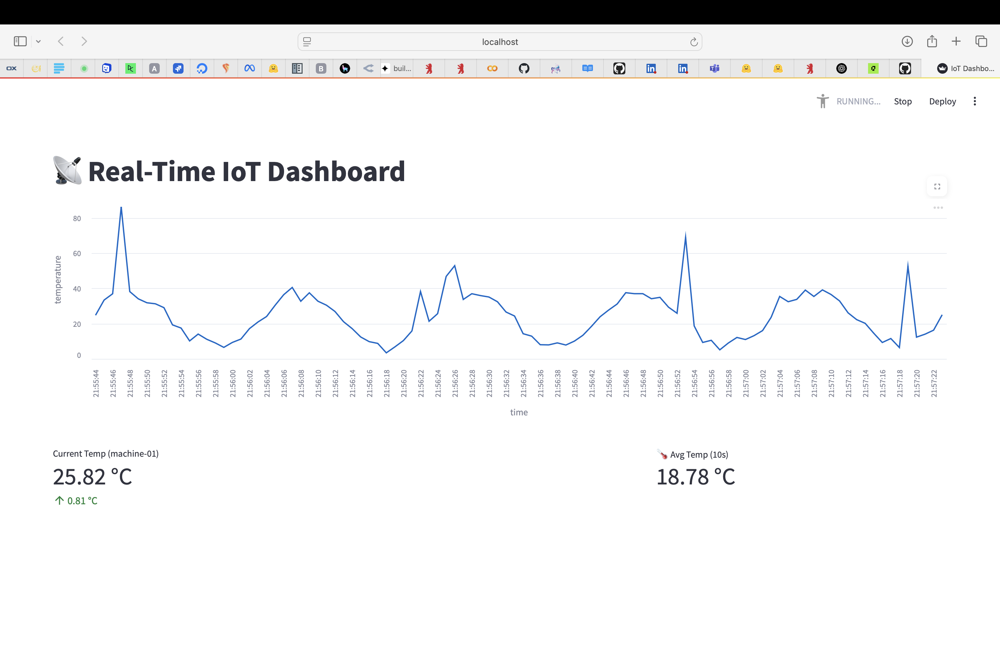

# Real-Time IoT Dashboard

This project is a real-time IoT data processing and visualization system built with **Apache Kafka**, **Quix Streams**, and **Streamlit**. It simulates IoT sensor data, applies streaming analytics (like alert detection and windowed aggregation), and displays the results in an interactive dashboard.

---

## Tech Stack

| Component         | Description                                                   |
|------------------|---------------------------------------------------------------|
| **Kafka**         | Message broker for real-time stream ingestion                |
| **Quix Streams**  | Python-based stream processing and windowed aggregation      |
| **Streamlit**     | Lightweight web framework for dashboarding and visualization |
| **Python**        | Core programming language used across all components         |

---

## Key Features

### Real-Time Sensor Simulation
A producer script (`sensor_producer.py`) continuously generates simulated temperature data from an IoT device.

### Intelligent Alert System
A separate stream processor (`alert.py`) detects high temperature values (Kelvin > 303K ≈ 30°C) and pushes alert messages to a dedicated topic.

### Windowed KPI Aggregation

| KPI                  | Logic                                              | Refresh Rate |
|----------------------|----------------------------------------------------|--------------|
| **Current Temp**      | Latest sensor value with delta from last reading  | 1 second     |
| **Alerts (5s)**       | Count of alerts in a 5-second tumbling window     | 5 seconds    |
| **Avg Temp (10s)**    | Average temperature over last 10 seconds          | 10 seconds   |

### Interactive Web Dashboard
Displays metrics side by side using `st.columns()` and plots real-time temperature trends using a line chart.

---

## 🖼️ Dashboard Screenshot



---

## Project Structure

```text
.
├── sensor_producer.py         # Simulates and publishes sensor data
├── alert.py                   # Detects high temperature and emits alerts
├── alert_counter.py           # Counts alerts in 5s window and writes to topic
├── avg_temperature.py         # Computes 10s average temperature
├── dashboard.py               # Streamlit app for visualization
├── dashboard.png              # Screenshot of dashboard
└── README.md                  # Project documentation


---

## 🚀 How to Run the System

### 🛠️ Prerequisites

- Python 3.8+
- Kafka running locally (`localhost:9092`)
- Python packages: `quixstreams`, `streamlit`

### 🔌 Install Dependencies
```bash
pip install quixstreams streamlit


###
```bash
python producer.py


###
```bash
python alert.py

###
```bash
python alert.py


 Run KPI Pipelines

 ### launch the dashboard
 ```bash
streamlit run dashboard.py

